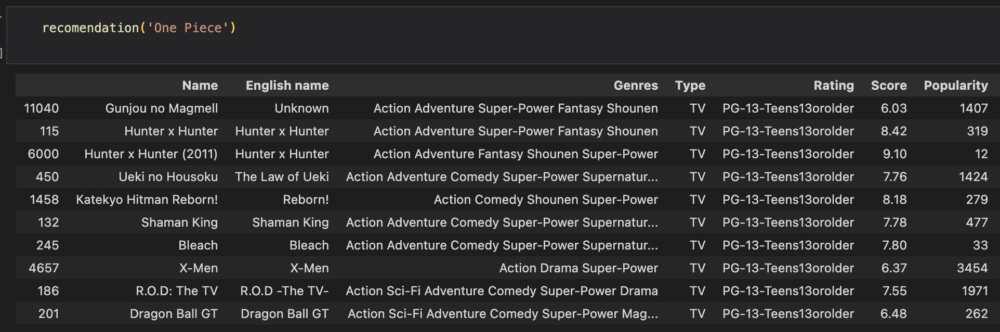
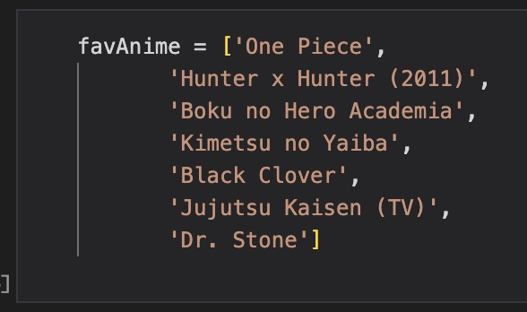
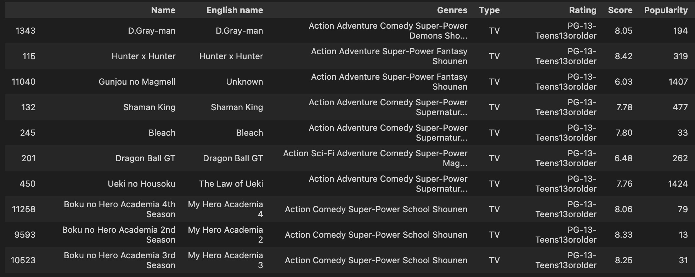

# **README**
Please, read this before before you continue to read / run the Jupyter Notebook file.

This notebook is created as a project portfolio for me to participate in Data Science & Machine Learning course in Purwadhika. The notebook is about creating Recommendation System with Content Based strategy and User Profile Based strategy. So this is my portfolio to work on my learning journey towards data science. This recommendation is a simple generator, might have some flaws, but i tried my best. ;D

The dataset used here is a **2020 Anime List Database** from MyAnimeList. It's attached in this repo or you can also download it through Kaggle [here](https://www.kaggle.com/datasets/hernan4444/anime-recommendation-database-2020) for recent file version. The data is not mine!

## **Glimpse look at what i do here**
### **Content Based Strategy**
Basically, in content based strategy i create TF IDF calculation based on several columns like Genres, Type, Rating, Score, and Popularity Rank.

I create TF IDF Vectorizer table separately for Genres, Type, and Rating. Then, weighting it based on priority, like Genres x3, Type x2, and Rating x3.

After that, i concat those 3 TF IDF tables into one.

Then, i combining Score and Popularity Rank as a single metric. I scaled Popularity Rank to match the form of the score and do average on them both.

Afterwards, that new single metric is used to multiply each values in TF IDF table adding final weighting.

Then, i create Cosine Similarity to find match for each title.

Finally, i create a function to call the title that is similar with input title (anime you have watched)

Below is the result if you have watched One Piece:

### **User Profile Based Strategy**
Within this strategy, i just selected several rows in TF IDF table based on favorite anime (list of anime you like). Then, i aggregate the value (average) into a new single row.

I add the new single row into TF IDF table before recalculating the Cosine Similarity.

After that, i just get the title recommendation based on that Cosine Similarity.

If your favorite anime titles are:

Then, you will be recommended with:

---
###### **This notebook is created by Diki Renanda / @dikisahkan. You can reach me through any social media GitHub, Kaggle, Medium, LinkedIn, IG, and TikTok.**